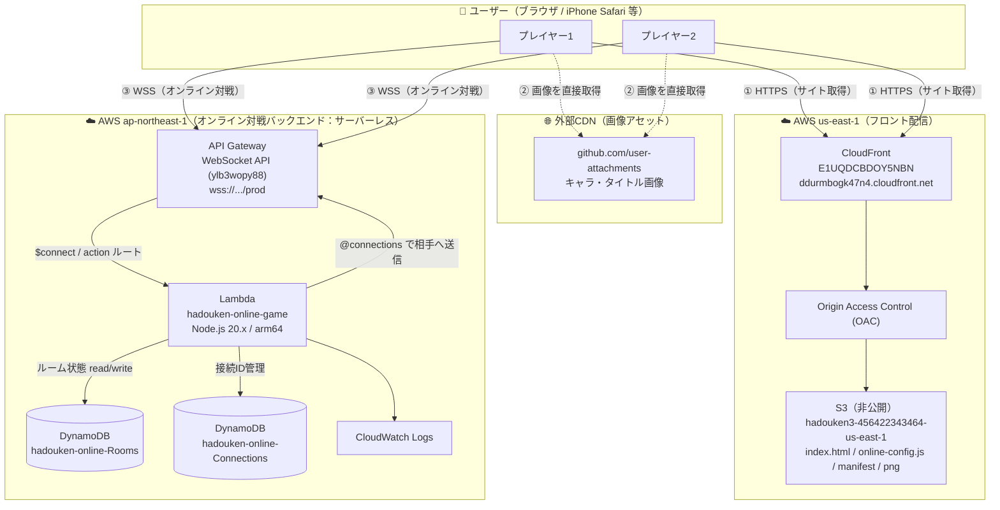
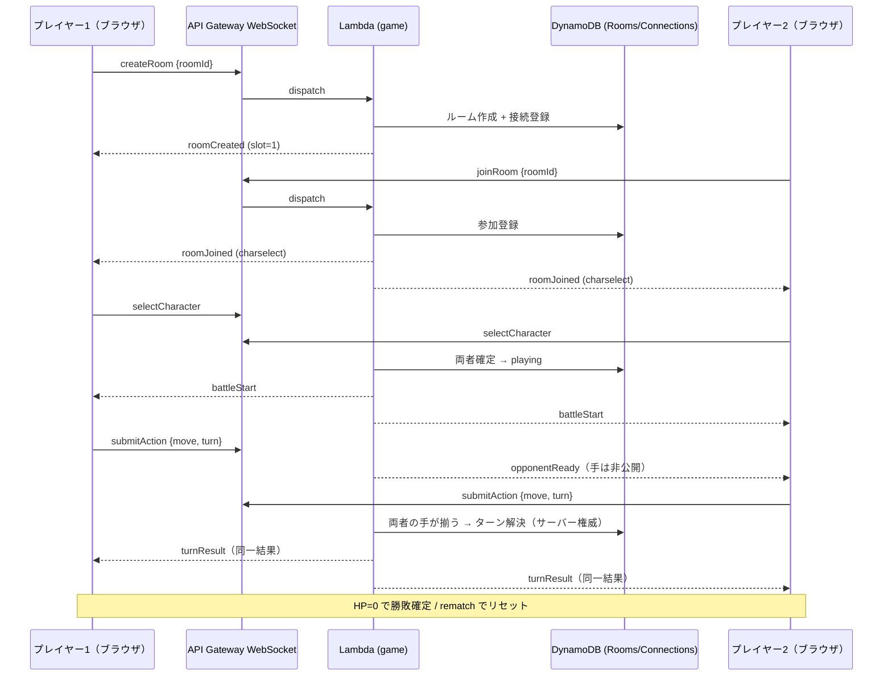
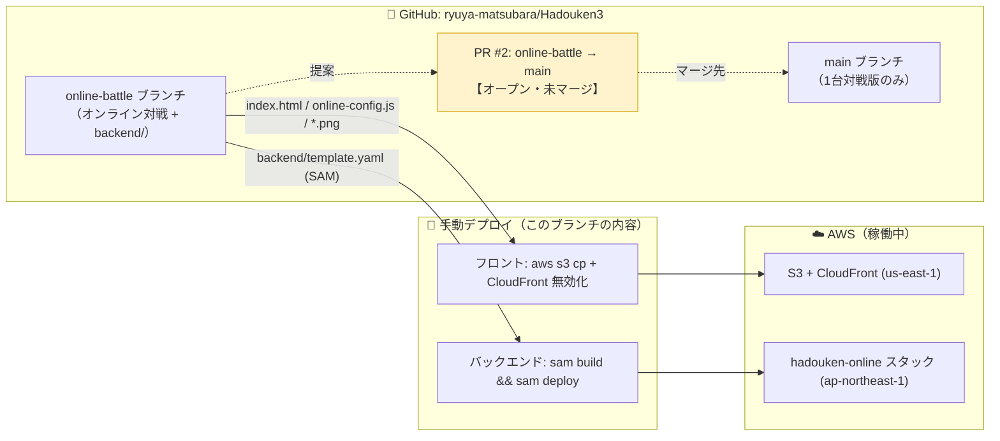

# Hadouken Battle — 構成図（AWS / GitHub）

現在デプロイされている構成のドキュメントです。
（フロント: `us-east-1` の S3+CloudFront / バックエンド: `ap-northeast-1` のサーバーレス）

## 1. システム全体（AWS ランタイム構成）

**ポイント**
- フロントは静的サイト。S3 は非公開で、CloudFront の **OAC** 経由でのみ配信。
- ゲーム画像は GitHub の CDN からブラウザが直接取得（AWS を経由しない）。
- オンライン対戦は **常時稼働サーバーなし**。WebSocket API → 単一 Lambda → DynamoDB。
- サーバーが権威（HP・エネルギーはサーバーが計算し、両クライアントへ同一結果を配信）。

## 2. オンライン対戦のメッセージフロー（2プレイヤー）

## 3. GitHub と デプロイの関係

**重要**
- AWS で今動いているのは **`online-battle` ブランチ（= PR #2 の内容）** をデプロイしたもの。
- **PR #2 は未マージ**。デプロイと PR のマージは独立（マージしなくても AWS では稼働する）。

## 主要リソース一覧

| 種別 | 名前 / ID | リージョン |
|---|---|---|
| CloudFront | `E1UQDCBDOY5NBN`（`ddurmbogk47n4.cloudfront.net`） | Global |
| S3（フロント・非公開） | `hadouken3-456422343464-us-east-1` | us-east-1 |
| WebSocket API | `ylb3wopy88`（`wss://ylb3wopy88.execute-api.ap-northeast-1.amazonaws.com/prod`） | ap-northeast-1 |
| Lambda | `hadouken-online-game` | ap-northeast-1 |
| DynamoDB | `hadouken-online-Rooms` / `hadouken-online-Connections` | ap-northeast-1 |
| CloudFormation スタック | `hadouken-online` | ap-northeast-1 |
| SAM アーティファクト用 S3 | `hadouken-online-sam-456422343464-apne1` | ap-northeast-1 |
